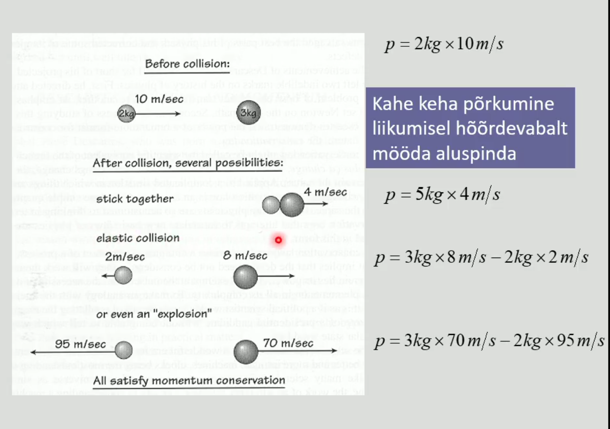

# Füüsika

## Antiikteadus

## Liikumine ja liikumishulk

- **1492** Christoph Kolumbes laheb laande Indiat avastama
- **1498** Vasco da Gama (Portugaalane) Indiasse

### Renessanss
- Tekkis XIV sajandil Itaalia rikkamates vabariikides: 
Fireneze (kalevitoostus), Veneetsi ja Genua (kaubandus)
- Dante 1265 - 1321
- Petrarca 1304 - 1374
- Leonardo da Vinci 1452 - 1519
    - Oppis ja arendas matemaatikat, optikat, mehaanikat, anatoomiat
    - Kavandas lennumasina, kudumismasina, kanalite kaevamise masina.
- Michekangelo 1475-1564
- Raffael 1483-1520

Loetakse selle maaliga korgrenessanssi alguseks

### Trükikunsti leiutamine 
- Hiinas juba XI sajandil trykkimine eraldi trykityypidega
- Euroopas Johannes Gutenber Mainzis
- 1455 esimene trykitud piibel
- Teaduse kui kollektiivse nahtuse arengu eeltingimus

### Reformatsioon

Mikolay Kopernik (1473-1543)
- Poola astronoom ja arst
- Taaselustas Aristarchose heliotstentrilise maailmapildi idee: Paike on keskset kohta vaariv ja ringjoon koige ideaalsem joon.
- Ptolemaiose epitsyklite systeem sailis 

Tycho Brahe (1546, 1601)
- Taani aadli jareltulija
- 1572 supernoova
- Kuningas Frederik II kingitus- Hveni saare observatoorium

Johannes Kepler (1571, 1630)
- Matemaatikaopetaja Grazis
- 1600 - Praha, kus tegutses Brahe,
kes suri aasta parast Kepleri saabumist
- Jumala tahe peab valjenduma matemaatilises ilus - 
taiuslikud geomeetrilised kujundid.

Iga planeedi tiirlemispersioodi (aasta) kestuse ruut
on vordeline orbiidi suure pooltelje kuubiga.

**Kepleri kolmas seadus:**
\begin{equation}
T^2 ~ r^3
\end{equation}
Planeet, mille orbiidi raadius on 4 korda suurem Maa omast,
teeb ymber paikese tiiru 8 aastaga.

### Liikumishulk
- Liikumishulk on keha kiiruse ja massi korrutis
- Kui kaks keha põrkuvad, võiub liikumishulk küll 
ühelt kehalt teisele üle kanduda, kuid nende summaarne
liikumishul jääb muutumatuks.
- Lisaks liikumise kiiruse suurusele tuleb selle seaduse
puhul arvestada ka kiiruse suunda.

### Liikumishulga jaavuse seadus
Osakese liikumishulk on vektor, mida moodetakse osakese massi ja kiirusevektori
korrutisega.
\begin{equation}
\vec{p} = m \vec{v}
\end{equation}

Isoleeritud systeemi summaarne liikumishulk
\begin{equation}
\sum{\vec{p}} = const
\end{equation}

**Tuleks teada:**

1. Trykikunst 1455
2. Kolumbus 1492
3. Luther 1517

