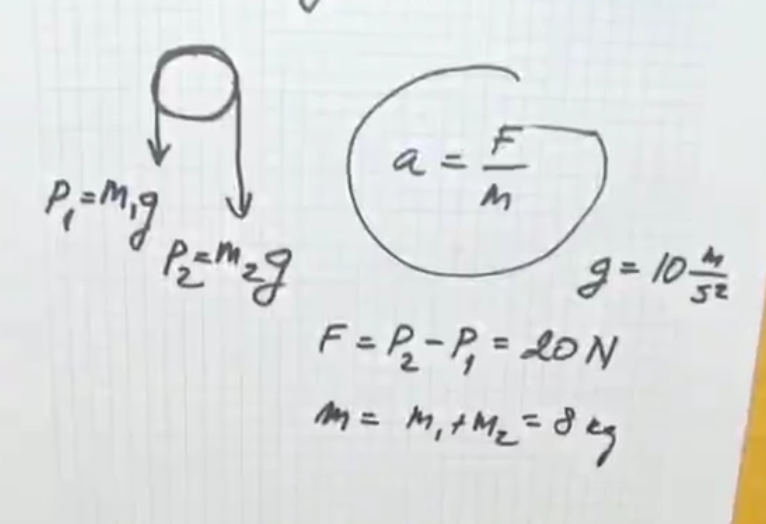
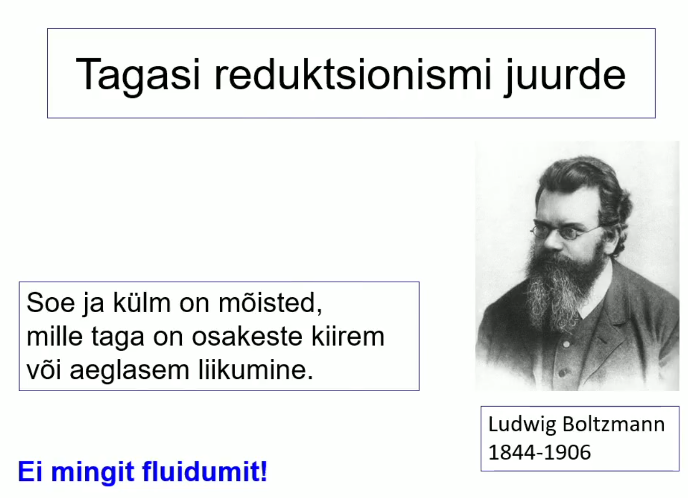

# Füüsika

## Todos
- [ ] Antiikteadus (loeng 1)
- [x] Liikumine ja liikumishul(loeng 2)
- [x] Newtoni seaduse(loeng 3)
- [x] Energia ja romantism(loeng 4)
- [ ] Entroopia (loeng 5)
- [ ] Elekter ja magnetism (loeng 6)
- [ ] Võnkumised ja lained (loeng 7)

## Antiikteadus

## Liikumine ja liikumishulk

- **1492** Christoph Kolumbes laheb laande Indiat avastama
- **1498** Vasco da Gama (Portugaalane) Indiasse

### Renessanss
- Tekkis XIV sajandil Itaalia rikkamates vabariikides: 
Fireneze (kalevitoostus), Veneetsi ja Genua (kaubandus)
- Dante 1265 - 1321
- Petrarca 1304 - 1374
- Leonardo da Vinci 1452 - 1519
    - Oppis ja arendas matemaatikat, optikat, mehaanikat, anatoomiat
    - Kavandas lennumasina, kudumismasina, kanalite kaevamise masina.
- Michekangelo 1475-1564
- Raffael 1483-1520

Loetakse selle maaliga korgrenessanssi alguseks

### Trükikunsti leiutamine 
- Hiinas juba XI sajandil trykkimine eraldi trykityypidega
- Euroopas Johannes Gutenber Mainzis
- 1455 esimene trykitud piibel
- Teaduse kui kollektiivse nahtuse arengu eeltingimus

### Reformatsioon

Mikolay Kopernik (1473-1543)
- Poola astronoom ja arst
- Taaselustas Aristarchose heliotstentrilise maailmapildi idee: Paike on keskset kohta vaariv ja ringjoon koige ideaalsem joon.
- Ptolemaiose epitsyklite systeem sailis 

Tycho Brahe (1546, 1601)
- Taani aadli jareltulija
- 1572 supernoova
- Kuningas Frederik II kingitus- Hveni saare observatoorium

Johannes Kepler (1571, 1630)
- Matemaatikaopetaja Grazis
- 1600 - Praha, kus tegutses Brahe,
kes suri aasta parast Kepleri saabumist
- Jumala tahe peab valjenduma matemaatilises ilus - 
taiuslikud geomeetrilised kujundid.

Iga planeedi tiirlemispersioodi (aasta) kestuse ruut
on vordeline orbiidi suure pooltelje kuubiga.

**Kepleri kolmas seadus:**
\begin{equation}
T^2 ~ r^3
\end{equation}
Planeet, mille orbiidi raadius on 4 korda suurem Maa omast,
teeb ymber paikese tiiru 8 aastaga.

### Liikumishulk
- Liikumishulk on keha kiiruse ja massi korrutis
- Kui kaks keha põrkuvad, võiub liikumishulk küll 
ühelt kehalt teisele üle kanduda, kuid nende summaarne
liikumishul jääb muutumatuks.
- Lisaks liikumise kiiruse suurusele tuleb selle seaduse
puhul arvestada ka kiiruse suunda.

### Liikumishulga jaavuse seadus
Osakese liikumishulk on vektor, mida moodetakse osakese massi ja kiirusevektori
korrutisega.
\begin{equation}
\vec{p} = m \vec{v}
\end{equation}

Isoleeritud systeemi summaarne liikumishulk
\begin{equation}
\sum{\vec{p}} = const
\end{equation}

**Tuleks teada:**

1. Trykikunst 1455
2. Kolumbus 1492
3. Luther 1517

## Newtoni seadused

### Newtoni 1. seadus
Kui keha ei tülitata, siis on ta paigal või liigub ühtlase kiirusega mööda sirgjoont.

*Täpsemalt: Keha liigub ühtlases ja sirgjooneliselt siis, kui temale mõjuvad jõud on tasakaalus.*

### Newtoni 2. seadus
Keha liigub kiirendusega, kui talle mõjub jõud.
\begin{equation}
\vec{F} = m\vec{a}
\end{equation}
Mida suurem on jüud, seda suurem kiirendus.
Sama jõu puhul on suurema massi kiirendus väiksem. Mass on keha intertsi mõõduks.

### Newtoni 3. seadus

Kui üks keha avaldab teisele kehale jõudu, siis
teine keha vastab samaga.

### Järeldusi Newtoni seadustest
- Inerts on keha omadus säilitada oma liikumise olekut.
- Inertsiaalsüsteem on selline taustsüsteem, kus kehtib inertsiseadus
- Newtoni seadused kehtivad vaid inertsiaalsüsteemides
- Mass on keha inertsi mõõduks

### Vaba langemine 
Galilei kehade langemise seletus sobib Newtoni skeemi:
- konstantne kiirendus on raskuskiirendus
- konstante jõud on keha kaal

\begin{equation}
\vec{P} = m \vec g
\end{equation}

*Kaal on vektor, mass on skalaar*

### Kiirendus

Kiirendus näitab kiiruse muutumist.
Muutuda saavad kiiruse suurus ja kiiruse suund.

#### Ringliikumine

Kui muutub ainult kiiruse suund, saame ühtlase ringliikumise.
Ühtlase ringliikumise kiirendust nimetatakse kesktõmbekiirenduseks:

\begin{equation}
a = \frac{v^2}{r}
\end{equation}

Kiiruse suunda muudab kesktõmbejõud:
\begin{equation}
F = m\frac{v^2}{r}
\end{equation}

Kus: 
**v** - kiiruse suurus
**r** - ringjoone raadius

### Pöörlemishulk

Teljega risti oleval ringjoonel liikuva osakese
pöörlemishulk on 
\begin{equation}
L = mvr
\end{equation}

*m* on osakese mass
*v* on osakese kiirus (suunda arvestades)
*r* on osakese kaugus pöörlemisteljest

### Newtoni gravitatsiooniseadus

\begin{equation}
F = G \frac{m M}{r^2}
\end{equation}
*F* on kahe keha vaheline tõmbejõud
*m* ja *M* on kehade massid
*r* on kehade vaheline kaugus

\begin{equation}
g = 6.6726 * 10^{-11} nm^2kg^{-2}
\end{equation}

Gravitatsiooniseaduse rakendimine maa lähedal annab raskuskiirenduse

\begin{equation}
G\frac{M}{R^2} = g
\end{equation}
Siin M on Maa mass ja R on maa raadius

## Esteetika ja füüsika
- Kopernik paigutas Päikese süsteemi keskele
ilu kaalutlustel - ta ju valgustab meid.
- Kepler aimas, et Päikesel on peale valgustamise veel teinegi funktsioon - panna planeedid liikuma
_ **Newton** näitas, et tal oli õigus

### Seitse põhiühukut

- Pikkus - meeter
- Aeg - seknud
- Mass - kilogramm
- Elektrivoolu tugevus - amper
- Temperatuur - Kelvini kradd
- Valgustugevus - kandela
- Ainehulk - mool

### Ülesanded

Lahendus

Sama jõud mõjub mõlemale. Samal teel sõidetakse konstantse 
kiirusega.

Lahendus

\begin{equation}
\sum \vec{F} = m \vec{a}
\\
a = g = const
\end{equation}

Lahendus

## Energia ja romantism

Kaks maailmavaadet: 
Redukstionism - looduse mõistmiseks on tarvis teada väheseid lihtsaid printsiipe. **Loodus on masin.**

Holism - looduse mõistmisel on tähtsam teada tema osiste suhete ning seoste keerukat võrku. **Loodus on organism.**

Kineetiline energia on energia, mida keha omab liikuimise tõttu.

\begin{equation}
K = \frac{1}{2} mv^2
\end{equation}
*m on keha mass
v on keha kiirus*

### Töö

Töö arvutamiseks korrutatakse jõu väärtus kaugusega, milleni keha liigub jõu mõjumise suunas.

\begin{equation}
A = Fx cos0
\end{equation}
Tööd mõõdetakse dzaulides (J)

### Võimsus on energa ülekande tempo
\begin{equation}
N = \frac {Fx}{t} = Fv
\end{equation}

- F on jõud.
- x on liikumise kaugus piki jõu mõjumise suunda
- t on aeg
- v on kiirus
**Võimsust mõõdetakse vattides (W)**

### Potentsiaalne energia

- Potentsiaalne energia on energia, mis on kehadel nende asendi tõttu.
- Teatud kõrgusele tõstetud keha potentsiaalne energia:
\begin{equation}
V = mgh
\end{equation}
- m on keha mass
- g = `9.81ms^2` on raskuskiirendus
- h on kõrgus (maapinna kohal)

Näide

### Boltzmann ja Joule

### Mehaanilise energia jäävus

Teatud kõrgusele tõstetud keha potentsiaalne energia on muundatav kineetiliseks
ja kineetilisest energias on võimalik tagasi saada 
potentsiaalne energia.
\begin{equation}
\frac{1}{2}mv^2+mgh = const
\end{equation}

### Emotio sukeldus romantismi
- Klassikaliste ideaalide kord, tasakaal ja
vaoshoitus oli ära tüütanud
- Uuteks ideaalideks vabadus, liikumine kirja ja 
saavutamatu taotlemine
- Uuteks teemadeks igavik, minevik või tulevik
ja kaugete maade avarused.
- Natuurfilosoofia koolkond Saksamaal rõhutas
looduse ühtsust. 

Rokokoo nimetus tuleb teokarbist.

### Ülesanded

1. Mees hoiab kogu jõuga püsti seina,
mis kipub ümber kukkuma.
Kas mees teeb tööd?
    1. Ei tee (Liikumist ei toimu)
2. Raamat kukub lauat maha.
Kas sellels protsessis tehakse tööd?
    1. Jah. Rasksuskiirendus.
3. Kelner hoiab ühe käega raske kandikut pea kohal
ja liigub ühtlase kiirusega läbi ruumi. Kas
kelner teeb tööd?
    1. Ei tee, sest nurk kelneri ja kandiku vahel
    on 90 kraadi ehk koosinus 90 on null ja seega
    on töö null. Samamoodi ei tee tööd ükski
    objekt, mis sooritab ühtlast ringliikumist.
4. A ja b on jõusaalis. A tõstab 20-kgse massiga
sangpommi 1 meetris kõrgusele 10 korda ühe minuti jooksul, 
B aga samasugust pommi sama kõrgele 10 korda 30 sekundi
jooksul. Kumb teeb rohkem tööd? Kumba võimsus on suurem?
    1. Sama palju tööd. 
    2. B võimsus on suurem. 
5. A ja B jooksevad mäkke. A mass on 2 korda suurem
kui B mass. B jõuab mäetippu 2 korda lühema ajaga kui A.
Kumb tegi rohkem tööd? Kumma võimsus on suurem?
    1. A, sest tema mass on 2x suurem.
    2. Sama suur võimsus.
6. 
