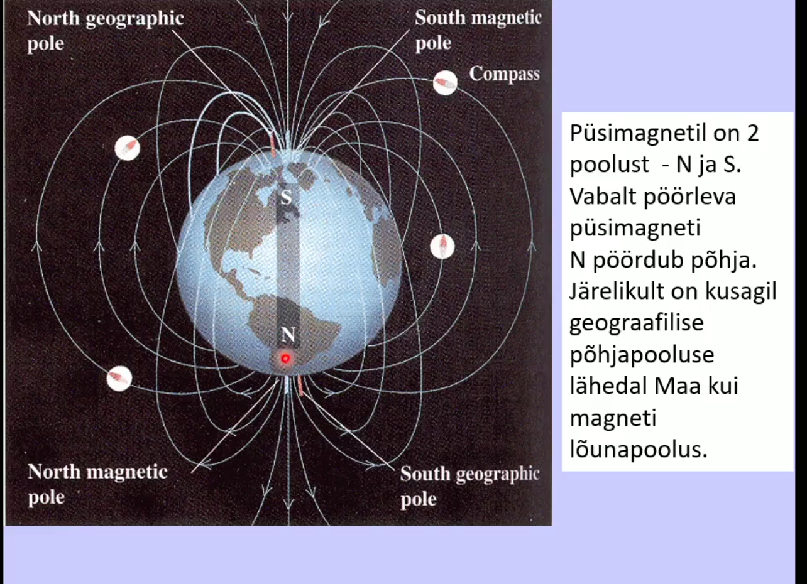

# Füüsika

## Todos
- [x] Antiikteadus (loeng 1)
- [x] Liikumine ja liikumishul(loeng 2)
- [x] Newtoni seaduse(loeng 3)
- [x] Energia ja romantism(loeng 4)
- [x] Entroopia (loeng 5)
- [x] Elekter ja magnetism (loeng 6)
- [x] Võnkumised ja lained (loeng 7)
- [ ] Unknown

## Antiikteadus

## Liikumine ja liikumishulk

- **1492** Christoph Kolumbes laheb laande Indiat avastama
- **1498** Vasco da Gama (Portugaalane) Indiasse

### Renessanss
- Tekkis XIV sajandil Itaalia rikkamates vabariikides: 
Fireneze (kalevitoostus), Veneetsi ja Genua (kaubandus)
- Dante 1265 - 1321
- Petrarca 1304 - 1374
- Leonardo da Vinci 1452 - 1519
    - Oppis ja arendas matemaatikat, optikat, mehaanikat, anatoomiat
    - Kavandas lennumasina, kudumismasina, kanalite kaevamise masina.
- Michekangelo 1475-1564
- Raffael 1483-1520

Loetakse selle maaliga korgrenessanssi alguseks

### Trükikunsti leiutamine 
- Hiinas juba XI sajandil trykkimine eraldi trykityypidega
- Euroopas Johannes Gutenber Mainzis
- 1455 esimene trykitud piibel
- Teaduse kui kollektiivse nahtuse arengu eeltingimus

### Reformatsioon

Mikolay Kopernik (1473-1543)
- Poola astronoom ja arst
- Taaselustas Aristarchose heliotstentrilise maailmapildi idee: Paike on keskset kohta vaariv ja ringjoon koige ideaalsem joon.
- Ptolemaiose epitsyklite systeem sailis 

Tycho Brahe (1546, 1601)
- Taani aadli jareltulija
- 1572 supernoova
- Kuningas Frederik II kingitus- Hveni saare observatoorium

Johannes Kepler (1571, 1630)
- Matemaatikaopetaja Grazis
- 1600 - Praha, kus tegutses Brahe,
kes suri aasta parast Kepleri saabumist
- Jumala tahe peab valjenduma matemaatilises ilus - 
taiuslikud geomeetrilised kujundid.

Iga planeedi tiirlemispersioodi (aasta) kestuse ruut
on vordeline orbiidi suure pooltelje kuubiga.

**Kepleri kolmas seadus:**
\begin{equation}
T^2 ~ r^3
\end{equation}
Planeet, mille orbiidi raadius on 4 korda suurem Maa omast,
teeb ymber paikese tiiru 8 aastaga.

### Liikumishulk
- Liikumishulk on keha kiiruse ja massi korrutis
- Kui kaks keha põrkuvad, võiub liikumishulk küll 
ühelt kehalt teisele üle kanduda, kuid nende summaarne
liikumishul jääb muutumatuks.
- Lisaks liikumise kiiruse suurusele tuleb selle seaduse
puhul arvestada ka kiiruse suunda.

### Liikumishulga jaavuse seadus
Osakese liikumishulk on vektor, mida moodetakse osakese massi ja kiirusevektori
korrutisega.
\begin{equation}
\vec{p} = m \vec{v}
\end{equation}

Isoleeritud systeemi summaarne liikumishulk
\begin{equation}
\sum{\vec{p}} = const
\end{equation}

**Tuleks teada:**

1. Trykikunst 1455
2. Kolumbus 1492
3. Luther 1517

## Newtoni seadused

### Newtoni 1. seadus
Kui keha ei tülitata, siis on ta paigal või liigub ühtlase kiirusega mööda sirgjoont.

*Täpsemalt: Keha liigub ühtlases ja sirgjooneliselt siis, kui temale mõjuvad jõud on tasakaalus.*

### Newtoni 2. seadus
Keha liigub kiirendusega, kui talle mõjub jõud.
\begin{equation}
\vec{F} = m\vec{a}
\end{equation}
Mida suurem on jüud, seda suurem kiirendus.
Sama jõu puhul on suurema massi kiirendus väiksem. Mass on keha intertsi mõõduks.

### Newtoni 3. seadus

Kui üks keha avaldab teisele kehale jõudu, siis
teine keha vastab samaga.

### Järeldusi Newtoni seadustest
- Inerts on keha omadus säilitada oma liikumise olekut.
- Inertsiaalsüsteem on selline taustsüsteem, kus kehtib inertsiseadus
- Newtoni seadused kehtivad vaid inertsiaalsüsteemides
- Mass on keha inertsi mõõduks

### Vaba langemine 
Galilei kehade langemise seletus sobib Newtoni skeemi:
- konstantne kiirendus on raskuskiirendus
- konstante jõud on keha kaal

\begin{equation}
\vec{P} = m \vec g
\end{equation}

*Kaal on vektor, mass on skalaar*

### Kiirendus

Kiirendus näitab kiiruse muutumist.
Muutuda saavad kiiruse suurus ja kiiruse suund.

#### Ringliikumine

Kui muutub ainult kiiruse suund, saame ühtlase ringliikumise.
Ühtlase ringliikumise kiirendust nimetatakse kesktõmbekiirenduseks:

\begin{equation}
a = \frac{v^2}{r}
\end{equation}

Kiiruse suunda muudab kesktõmbejõud:
\begin{equation}
F = m\frac{v^2}{r}
\end{equation}

Kus: 
**v** - kiiruse suurus
**r** - ringjoone raadius

### Pöörlemishulk

Teljega risti oleval ringjoonel liikuva osakese
pöörlemishulk on 
\begin{equation}
L = mvr
\end{equation}

*m* on osakese mass
*v* on osakese kiirus (suunda arvestades)
*r* on osakese kaugus pöörlemisteljest

### Newtoni gravitatsiooniseadus

\begin{equation}
F = G \frac{m M}{r^2}
\end{equation}
*F* on kahe keha vaheline tõmbejõud
*m* ja *M* on kehade massid
*r* on kehade vaheline kaugus

\begin{equation}
g = 6.6726 * 10^{-11} nm^2kg^{-2}
\end{equation}

Gravitatsiooniseaduse rakendimine maa lähedal annab raskuskiirenduse

\begin{equation}
G\frac{M}{R^2} = g
\end{equation}
Siin M on Maa mass ja R on maa raadius

## Esteetika ja füüsika
- Kopernik paigutas Päikese süsteemi keskele
ilu kaalutlustel - ta ju valgustab meid.
- Kepler aimas, et Päikesel on peale valgustamise veel teinegi funktsioon - panna planeedid liikuma
_ **Newton** näitas, et tal oli õigus

### Seitse põhiühukut

- Pikkus - meeter
- Aeg - seknud
- Mass - kilogramm
- Elektrivoolu tugevus - amper
- Temperatuur - Kelvini kradd
- Valgustugevus - kandela
- Ainehulk - mool

### Ülesanded

Lahendus

Sama jõud mõjub mõlemale. Samal teel sõidetakse konstantse 
kiirusega.

Lahendus

\begin{equation}
\sum \vec{F} = m \vec{a}
\\
a = g = const
\end{equation}

Lahendus

## Energia ja romantism

Kaks maailmavaadet: 
Redukstionism - looduse mõistmiseks on tarvis teada väheseid lihtsaid printsiipe. **Loodus on masin.**

Holism - looduse mõistmisel on tähtsam teada tema osiste suhete ning seoste keerukat võrku. **Loodus on organism.**

Kineetiline energia on energia, mida keha omab liikuimise tõttu.

\begin{equation}
K = \frac{1}{2} mv^2
\end{equation}
*m on keha mass
v on keha kiirus*

### Töö

Töö arvutamiseks korrutatakse jõu väärtus kaugusega, milleni keha liigub jõu mõjumise suunas.

\begin{equation}
A = Fx cos0
\end{equation}
Tööd mõõdetakse dzaulides (J)

### Võimsus on energa ülekande tempo
\begin{equation}
N = \frac {Fx}{t} = Fv
\end{equation}

- F on jõud.
- x on liikumise kaugus piki jõu mõjumise suunda
- t on aeg
- v on kiirus
**Võimsust mõõdetakse vattides (W)**

### Potentsiaalne energia

- Potentsiaalne energia on energia, mis on kehadel nende asendi tõttu.
- Teatud kõrgusele tõstetud keha potentsiaalne energia:
\begin{equation}
V = mgh
\end{equation}
- m on keha mass
- g = `9.81ms^2` on raskuskiirendus
- h on kõrgus (maapinna kohal)

Näide

### Boltzmann ja Joule

## Entroopia

### Mehaanilise energia jäävus

Teatud kõrgusele tõstetud keha potentsiaalne energia on muundatav kineetiliseks
ja kineetilisest energias on võimalik tagasi saada 
potentsiaalne energia.
\begin{equation}
\frac{1}{2}mv^2+mgh = const
\end{equation}

### Emotio sukeldus romantismi
- Klassikaliste ideaalide kord, tasakaal ja
vaoshoitus oli ära tüütanud
- Uuteks ideaalideks vabadus, liikumine kirja ja 
saavutamatu taotlemine
- Uuteks teemadeks igavik, minevik või tulevik
ja kaugete maade avarused.
- Natuurfilosoofia koolkond Saksamaal rõhutas
looduse ühtsust. 

Rokokoo nimetus tuleb teokarbist.

### Ülesanded

1. Mees hoiab kogu jõuga püsti seina,
mis kipub ümber kukkuma.
Kas mees teeb tööd?
    1. Ei tee (Liikumist ei toimu)
2. Raamat kukub lauat maha.
Kas sellels protsessis tehakse tööd?
    1. Jah. Rasksuskiirendus.
3. Kelner hoiab ühe käega raske kandikut pea kohal
ja liigub ühtlase kiirusega läbi ruumi. Kas
kelner teeb tööd?
    1. Ei tee, sest nurk kelneri ja kandiku vahel
    on 90 kraadi ehk koosinus 90 on null ja seega
    on töö null. Samamoodi ei tee tööd ükski
    objekt, mis sooritab ühtlast ringliikumist.
4. A ja b on jõusaalis. A tõstab 20-kgse massiga
sangpommi 1 meetris kõrgusele 10 korda ühe minuti jooksul, 
B aga samasugust pommi sama kõrgele 10 korda 30 sekundi
jooksul. Kumb teeb rohkem tööd? Kumba võimsus on suurem?
    1. Sama palju tööd. 
    2. B võimsus on suurem. 
5. A ja B jooksevad mäkke. A mass on 2 korda suurem
kui B mass. B jõuab mäetippu 2 korda lühema ajaga kui A.
Kumb tegi rohkem tööd? Kumma võimsus on suurem?
    1. A, sest tema mass on 2x suurem.
    2. Sama suur võimsus.
6. 

## Entroopia

Aine molekul mass on üks number Mendelejevi tabelis ja võtta ainehulk grammides, siis on tegemist ühe mooliga.
Näiteks: Vesi - Üks vesinik ja kaks hapnikku
ehk 16 + 1 + 1 saame 18 molekulmassiks, seega vee mool on 18 grammi.

### Molekulide kiirus ja temperatuur

Ruutkeskimine kiirus on seotud absoluutse (Kelvini) temperatuuriga.

\begin{equation}
T = \frac{m(v^{-II})^2}{3k}
\end{equation}
K on Boltzmanni konstant
`k = 1.38 * 10^-23 J/K`
Boltzmanni konstant seob omavahel molekulide soojusliikumise kineetilise energia ja absoluutse temperatuuri.

### Kelvin 

Kelvin on termodünaamilise temperatuuri mõõtühik, 
mis vastab temperatuuri niisugusele muutusele, 
mis kaasneb termodünaamilise energia muutusega `1.38*10^-23 J/K` 
dzauli võrra.

1. 0 K = -273.15 C
2. 1 K = 1 C = 1.8 F
3. 0 F = -18C
4. 0C = 32F

### Temperatuur ja soojus

- Keha temperatuur näitab molekulide liikumise keskmist
kineetilist energiat.
- Soojushulk on energia, mille ülekandumine põhjustab kehade temperatuuride muutumist.
- Aine erisoojuse on energia hulk, mis kulub 1 kg selle aine
temperatuuri tõstmiseks 1 kraadi võrra.
- Soojushulka mõõdetakse dzaulides.
NB! Rääkida saab ainult ülekantavase soojushulgast. Kogu 
kehas olev soojushulk on nonsenss.

Vee erisoojus on üks suuremaid ning seetõttu on talvel mere ääres 
soojem ja suvel külmem.

### Termodünaamikas esimene seadus
**1. Isoleeritud süsteemi energia on muutumatu suurus.**
Looduses ei teki energiat juurde ega kao ära. Energia
võib ainult muunduda ühest liigist teiseks.
**2. Esimest liiki *perpeetum mobile* on võimatu**
Esimest liiki *perpeetum mobile* on masin, mis teeb tööd mitte millegi arvel.

Soojusmasin kasutegur:

\begin{equation}
\eta = \frac{Q_1 - Q_2}{Q_1} \leq \frac{T_1 - T_2} {T_1}
\end{equation}

1. `Q_1` on soojendajalt saadud soojushulk.
2. `Q_2` on jahutajale antud soojushulk
3. `T_1` on soojendaja temperatuur.
4. `T_2` on jahutaja temperatuur

**NB! Ikka Kelvini temperatuur.**

### Entroopia 
Entroopia on ülekantava soojushulga ja selle
ülekandmise temperatuuri suhe
\begin{equation}
S = \frac{Q} T
\end{equation}
**Mida näitab entroopia ja temperatuuri korrutis?**
Näitab ülekantavat soojushulka.

Entroopia ühik on J/K
Mida kõrgem on temperatuur, seda väiksem on entroppia.

### Entroopia ja kasulik töö

Kasulik soojus, mille arvel soojusmasin teeb tööd:
\begin{equation}
Q_1 - Q_2 = A
\end{equation}

Carno't valemist ja entroopia definitsioonist
\begin{equation}
A \leq Q_1 - T_2 S_1 
\end{equation}

Entroopia iseloomustab tööks mittemuundatavaid soojushulki.

\begin{equation}
A = \eta Q_1 \leq \frac{T_1 - T_2} {T_1} Q_1 = (1 - \frac{T_2}{T_1})Q_1 = Q_1 - \frac{T_2 Q_1}{T_1} = Q_1 - T_2 S_1
\end{equation}

### Soojust kvaliteet
Soojusenergia kvaliteedi määrab tema ülekandmise temperatuur.
Mida kõrgem temperatuur, seda vähem läheb energiat kaduma.

*Temparatuuri alandamine küttesüsteemis ei ole kokkuhoid.*

### Termodünaamika teine seadus.
1. Teist liiki *perpeetum mobile* - soojusmasin, mis muudab kogu 
soojuse tööks - on võimatu.
2. Jahtuv keha saab kõrval tehtava töö abita soojendada ainult
niisuguseid kehasid, mille temperatuur on tema omast madalam.
3. Isoleeritud süsteemi entroopia püüab kasvada maksimumi.
Termodünaamika esimene seadus ütleb, mis on lubatud, teine seadus 
ütleb, mis tegelikult toimub.

### Pööratav ja mittepööratav protsess

1. Pööratava protsessi puhul ei teki ümbritevas
keskkonnas mingeid muutusi ja päripidisele
protsessile võib iseenesest järgneda vastupidine
protsess.
    1. Palli elastne põrge vastu seina
2. Mittepööratava protsessi puhul päripidisele
protsessile ei järgne iseenesest vastupidine protsess.
    1. Tinditilk vees

### Miks mõni protsess on pööratav?
Mitte ainult soojusel, vaid ka energial on kvaliteet,
mille määrab entroopia. Mehaaniline energia on 
kvaliteetsem kui soojusenergia.
*Koordineeritud ja juhuslik liikumine.*
Protsess on pööratav, kui energia kvaliteet on sama
*Palli elastne põrge.*
Madalama kvaliteediga energia ei saa iseenesest 
muunduda kõrgema kvaliteediga energiaks.
*Kukkuv ja kuumutatav kimi.*

### Negentroopia

Negentroopia on negatiivne entroopia.
Mida suurem on negentroopia, seda kvaliteetsem
on energia.

### Aja suund

- Mehaanika põhiseaduse ei määra aja suunda
- Aja suuna määrab mõnede protsesside pöördumatus.

### Impressionism ehk mulje

Formuleering 3: Isoleeritud süsteemi püüab kasvada maksimumi.

\begin{equation}
S = k ln W
\end{equation}
Kui *W* on suurim, siis *S* on maksimaalne

**Isoleeritud süsteemis toimuvad kõik protsessid nii, et süsteemi
makroolekut realiseerivate mikroolekute arv oleks suurim.**

*Korrastamatuse (mitte korralageduse!) kasvu seadus*

### Termodünaamikas II seaduse kitsendused.

- Väga väikestes mastaapides tekivad kergesti fluktuatsioonid
ja entroopia võib kahaneda
- Väga suurtes mastaapides pole seadus rakendatav, sest süsteem peab olema isoleeritud.

### Entroopia väljaspool füüsikat

Entroopia osutus üldisemaks mõisteks kui energia.
Avatud süsteemis võib entroopiat kahandada,
aga selleks on vaja sekkuda.
*Maja laguneb iseenesest*
*Prügi ei kao kuhugi*

Mittetasakaalulistes süsteemides, kust voolab läbi palju ainet
ja energiat, võivad iseenesest tekkida struktuurid.

### Miks Maal kestab elu?

Tuleb ja läheb soojuskiirgus. Atmosfääri ülapiirile saabuv
**energiahulk** on sama suur kui sealt lahkuv energiahulk, aga nende
**kvaliteedid** on erinevad.
Lühema lainepikkusega kiirguse entroopia väiksem - Päikese temperatuur on kõrgem kui Maa temperatuur.
Iga aastane **negentroopia** on `10^19 cal/K`.
Selle arvel tekivad korrastatud süsteemid ja kestab elu.

### Informatsioon 

Informatsioon on mõõdetav, informatsioon 
kirjeldab määramatuse vähendamist.

Valem mõõtmiseks: 
\begin{equation}
I = - \log_2 p
\end{equation}

### Ülesanded 

Vastus: c), b)

Vastus: d)

Vastus: a)

Vastus: a)

## Elekter ja magnetism

### Benjamin Franklin (1706-1790)

Philadelphia trükikoja omanik
*1751 Katseda ja vaatlused elektri kohta*
- Kaht liiki elektrilaengud
- Erinimelised tõmbuvad, samanimelised tõukuvad
- Tavaline aine on neutraalne, sest sisaldab kumbagi märgi laenguid võrdsel hulgal.

*Oli üks iseseisvusdeklaratsiooni koostajatest.*

### Charles Couloumb (1736-1806)
Nii nagu gravitatsioongi, rahuldab elektrijõud
pöördruudu seadust:

\begin{equation}
F = K \frac{qQ}{r^2}
\end{equation}
- *Q* ja *q* on laengud
- *r* on laenguvaheline kaugus
- K = `9*10^9NM^2/C^2` on konstant

Laengu ühik on kulon - 1C

### Laengu jäävuse seadus

- Aine, kus puuduvad vabad laengud on dielektrik
- Aine, mis sisaldab vabu laenguid, on juht
- Elektrilaeng on kvanditud. Kvandi suuruse määrab 
elektroni laeng: `q=-1.6*10^-19C`

Isoleeritud süsteemis on laengute algebraline summa konstantne.

Elektroni laengu suurus määrati alles aastal 1910

### Itaalia krahv Alessandro Volta (1745-1827)

### 1839 patenteerit dagerrotüüpia - esimene tõsiseltvõetav fotomenetlus
Nimi tuleb Louis Daguerre järgi (1787-1851)

**Mis järjekorras toimusid 19.sajandi avastused?**

### Michael Faraday (1791-1861)

Kaugmõju tõlgendused:
Newtoni arusaama kohaselt mõjutavad kehad teineteis mitte millegi vahendusel.
Faraday arusaama kohaselt toimib kaugmõju välja vahendusel.

### Väljatugevus

Elektivälja tugevus on positiivsele ühiklaengule mõjuv jüud.

Coulombi seadus väljatugevuse kaudu:

\begin{equation}
E = K \frac Q r^2
\\
F  = qE
\end{equation}

Väljatugevuse ühik on N/C

### Magnetväli 

Magnetvälju tekitavad ainult **liikuvad** laengud.
Elektrivool on laengute liikumine - Orstedi katse seletus: 

Magnetvälja väljajooned moodustavad kinniseid kontuure,
ent *ei näita jõu mõjumise suunda*

### Magnetjõud

Magnetväljas liikuvale laengule mõjub jõud, mis on risti nii laengu liikumise suuna kui magnetvälja suunaga.

\begin{equation}
F = qvB \sin 0
\end{equation}

- *q* on laeng
- *v* on laengu liikumise kiirus
- *B* on magnetiline induktsioon, mille suunda näitab magnetvälja väljajoon, ühik on tesla **T = N/Am** 0 on kiiruse ja magnetilise induktsiooni suuna vaheline nurk.

### Amper

Amper - on 1C/s ehk laengu "voolamise" tempo

### Seos elektri ja magnetismi vahel

Michael Faraday
- Näitas katsetega, et muutuv elektriväli tekitab magnetvälja ja muutuv magnetväli tekitab elektivälja.
- Oletas, et tegu on ühtse elektronmagnetvälja erikujudega.

### James Maxwell (1831-1879)
- Tõestas matemaatiliselt selle, mida Faraday oli näidanud katsetega.
- Traktaat elekrist ja magnetismist 1873
- Maxwelli võrrandid lubavad arvutada elektromagnetilise välja omadusi.

### Elektromagnetväli

Elektri- ja magnetväli on ühe terviku - elektromagnetvälja erinevad
avaldusvormid.

Kaasaliikuv süsteem - laeng seisab; elektrostaatiline väli.
Paigalseisev süsteem - laeng liigub; vool; elektriväli ja
magnetväli.
+ *Laeng lennukis*
+ *Vaatleja lemnnukis*
+ *Vaatleja lennuväljal*

## Võnkumised ja lained

### Harmooniline võnkumine 

- Hälve - kõrvalkalle taskaaluasendist
- Amplituud - Maksimaalne kõrvalkalle tasakaaluasendist
- Sagedus *f* - võngete arv sekundis (Hz)
- Periood T - ühe võnke aeg (s)
T = `1/f` f = 1/T

*Harmoonilisel võnkumisel ei muutu amplituud, sagedus ega periood.

### Peioodilise laine levimise kiirus

Laineharja levimise kiirus - laine faasikiirus.
Seos laine levimise kiiruse *c*, lainpeikkuse *λ*
ja sageduse *f* vahel.

\begin{equation}
c = \lambda f
\\
c =  \frac \lambda T
\end{equation}

Valguse ja teise elektromagnetiliste lainete
kiirus vaakumis: `300 000 km/s`
Hääle kiirus õhus `340 m/s`

### Seisulained

- Seisulained tekivad siis, kui laine on sulustatud kindlate piiride vahele.
- Seisulaine puhul on teatud ruumipunktides sõlmed, mis jäävad liikumatuks.
- Piirete vahele mahub täisarv poollainet
- **Ühe poollaine puhul räägitakse esimest harmoonikust**

### Interferentsimustrid
Interferentsi liigi antud punktis kahe allika vahel, millest lained 
väljuvad samas faasisis määrab suhe

\begin{equation}
q = \frac {L_1 - L_2} \lambda
\end{equation}

- `L_1` ja `L_2` on kaugused kummastki allikast
- `λ` on lainepikkus

+ Täisarvulise q puhul on interferents täiuslikult konstruktiivne
+ Poolarvulise q puhul on interferents täiuslikult destruktiivne

### Heli

- Heli koosneb sinusoidaalsetest heliltugeainetest.
- Helihark annab ainult ühe sinusoidi.
- Heli tugevust näitab võnkumise amplituud.
- Heli kõrgust näitab võnkumise sagedus. 

### Vikerkaar

Vikerkaar on vihmapilv, kus piiskades erinevate nurkade all murduv valgus.

### Halo

Selleks on vaja jääkristalle.
Kõrgel pilvedel on kristallid olemas.

# Teine osa

