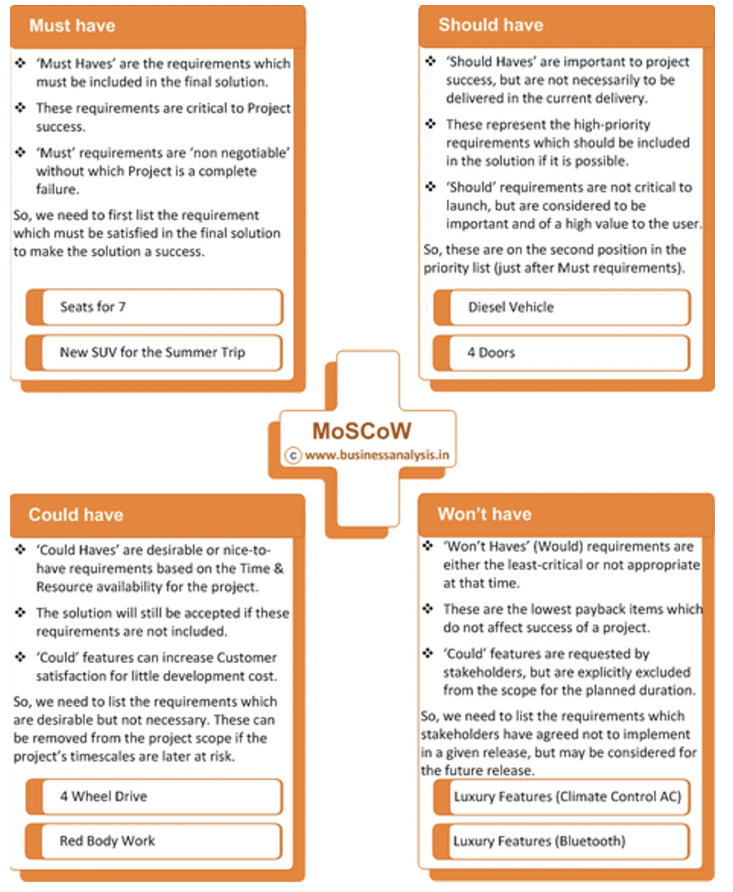
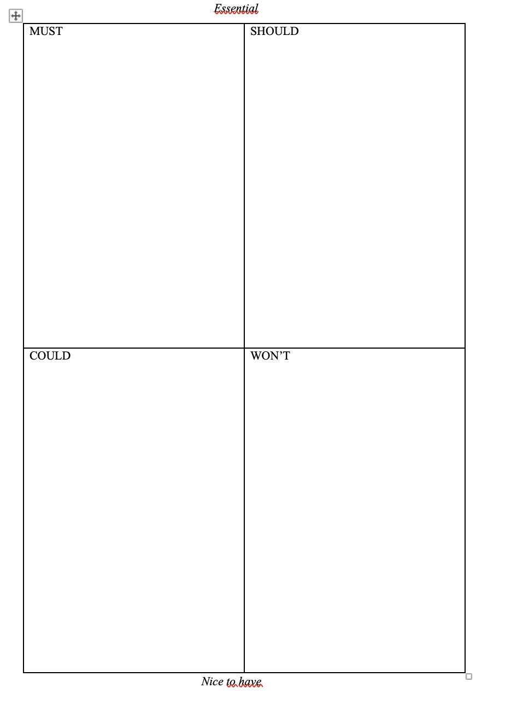

# Traditsionaalne arendusviis (Waterfall)

**PADIO** - planning, analysis, design, implementation, operations/ongoing maintenance.

## Moscow

*MoSCoW was developed by Dai Clegg of Oracle UK in 1994 and has been made popular by exponents of the Dynamic Systems Development Method (DSDM)*

Once there is a clear set of requirements, it is important to rank them. This ranking helps everyone (customer, project manager, designer, developers) understand the most important requirements, in what order to develop them, and what not to deliver if there is pressure on resources.

MoSCoW stands for must, should, could and would:
•	M - Must have this requirement to meet the business needs
•	S - Should have this requirement if possible, but project success does not rely on it
•	C - Could have this requirement if it does not affect anything else on the project
•	W - Won't have; would like to have this requirement later, but delivery won't be this time

MoSCoW as a prioritisation method is used to decide which requirements to complete first, which must come later and which to exclude.

Näited: 

## Use case

FURPS+ on 1992. aastal Robert Grady poolt väljatöötatud nõuete klassifitseerimise süsteem.

## FURPS
[Link to the file](extra/furps.docs)

1. Functionality
2. Usability
3. Reliability
4. Performance
5. Supportability
