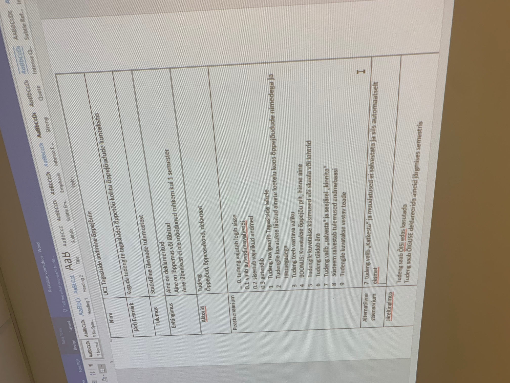

# Traditsionaalne arendusviis (Waterfall)

**PADIO** - planning, analysis, design, implementation, operations/ongoing maintenance.

## Use case

FURPS+ on 1992. aastal Robert Grady poolt väljatöötatud nõuete klassifitseerimise süsteem.

## FURPS
[Link to the file](extra/furps.docs)

1. Functionality
2. Usability
3. Reliability
4. Performance
5. Supportability
